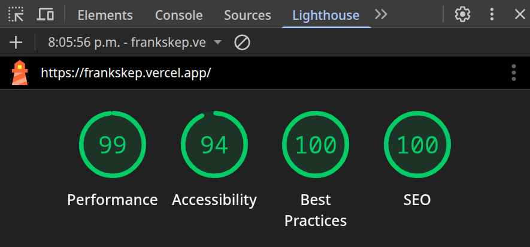

# Portfolio

This is my personal portfolio, developed with **SvelteKit** and **TailwindCSS**, designed to be fast, minimalist, and efficient.

## Features

- **Bilingual**: Supports English and Spanish with seamless language switching
- **Responsive Design**: Optimized for all devices and screen sizes
- **Performance Optimized**: Compressed assets with gzip and Brotli
- **Modern UI**: Clean, professional design with smooth animations
- **Dynamic Content**: JSON-based data structure for easy updates

## Sections

- **Home**: Introduction and current status
- **Projects**: Showcase of featured projects with detailed descriptions
- **Experience**: Professional work history and responsibilities
- **Technologies**: Technology stack and skills
- **Education**: Academic background
- **Certifications**: Professional certifications and courses
- **Contact**: Social media and contact information

## Tech Stack

- **Frontend**: [SvelteKit](https://kit.svelte.dev/), [TailwindCSS](https://tailwindcss.com/)
- **Icons**: [Iconify](https://iconify.design/)
- **Data**: Dynamic content based on JSON for flexibility and performance.
- **Compression**: [vite-plugin-compression2](https://github.com/alloc/vite-plugin-compression) for gzip and Brotli.

## Lighthouse Score

_Results generated with [Google Lighthouse](https://developers.google.com/web/tools/lighthouse)._

## License

**[GNU Affero General Public License v3.0](https://www.gnu.org/licenses/agpl-3.0.html)** See the [LICENSE](LICENSE) file for more information.
